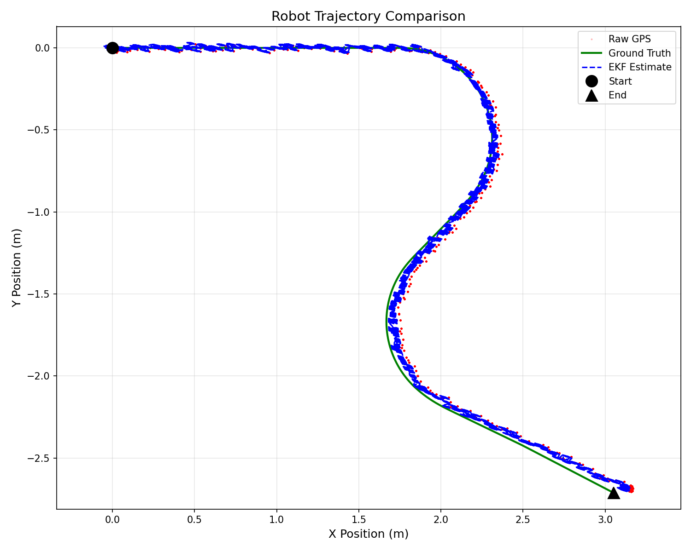
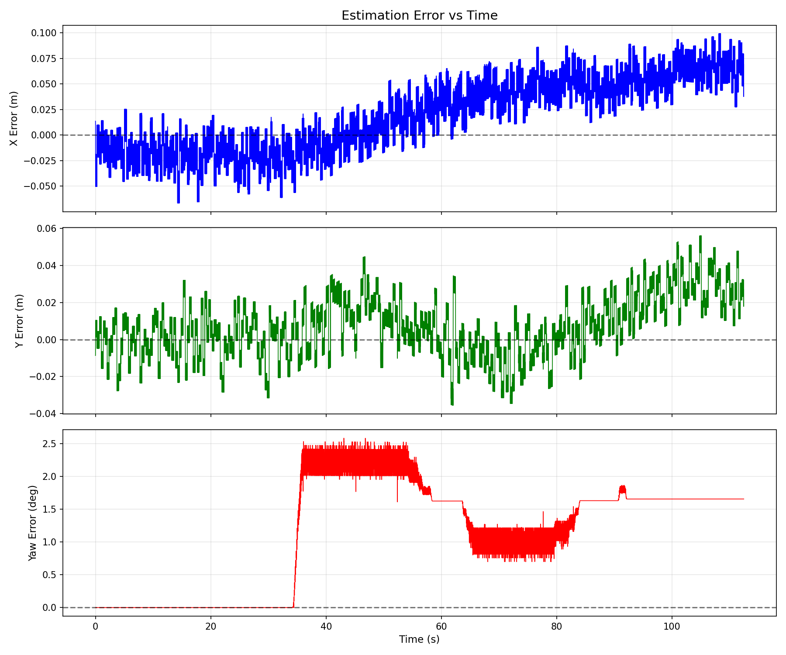
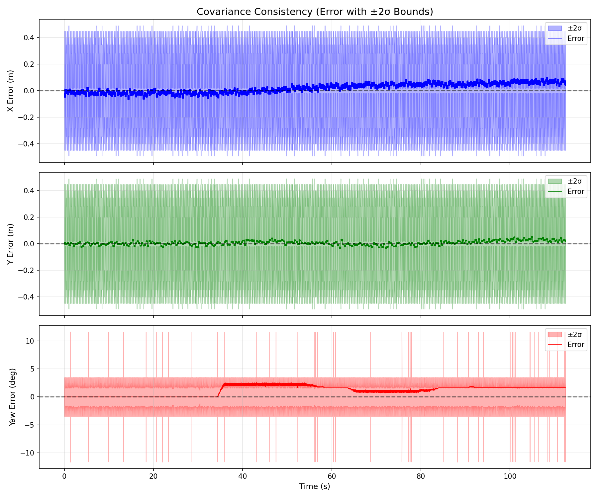

# Plots and Performance Analysis

This document describes the visualization tools and performance results for the EKF localization system.

## Experimental Results

### Test Configuration

- **Duration:** ~110 seconds
- **Robot:** TurtleBot3 Burger with GPS sensor
- **Trajectory:** Curved path covering ~3 meters
- **GPS accuracy:** RTK-like (1 cm noise)

### RMSE Comparison

| Metric | Raw GPS | EKF Estimate | Improvement |
|--------|---------|--------------|-------------|
| X (m) | 0.0617 | 0.0423 | 31% |
| Y (m) | 0.0170 | 0.0178 | - |
| 2D (m) | 0.0640 | 0.0459 | 28% |
| Yaw (deg) | 1.38 | 1.40 | - |

**Key Finding:** EKF reduced 2D position RMSE by 28% compared to raw GPS.

### Trajectory Plot



Shows the robot path in 2D space:
- **Green line:** Ground truth trajectory
- **Blue dashed:** EKF estimated trajectory
- **Red dots:** Raw GPS measurements

The EKF estimate closely tracks the ground truth while filtering GPS noise.

### Error vs Time



Observations:
- X error: ±10 cm range, slight drift towards end
- Y error: ±4 cm range, stable
- Yaw error: ~2° during motion, bounded

Errors remain bounded throughout the 110-second run.

### Covariance Consistency



Observations:
- Position errors stay within ±2σ bounds (shaded regions)
- The filter is consistent - uncertainty estimates are meaningful
- ~95% of errors fall within the predicted bounds

## Implementation Choices

### Ground Truth Source

**Choice:** Use `/odom` from Gazebo as ground truth.

**Justification:** In Gazebo simulation, the diff_drive plugin computes odometry directly from the physics engine wheel states:

- No sensor noise is added
- No drift accumulation occurs
- Position is computed from exact wheel rotations

This makes `/odom` a valid ground truth reference for simulation-based evaluation.

### Data Logging

**Choice:** Single CSV file with synchronized timestamps.

**Justification:** CSV format is simple and compatible with standard analysis tools (pandas, MATLAB). Synchronizing on EKF publish events ensures temporal alignment.

### RMSE Calculation

**Choice:** Compare both EKF output and raw sensors against ground truth.

**Justification:** This demonstrates the improvement gained from sensor fusion.

## Usage Instructions

### Step 1: Launch Simulation and Logger

```bash
# Terminal 1: Simulation + EKF
ros2 launch ekf_localization_tb3 ekf_localization.launch.py

# Terminal 2: Data logger
ros2 run ekf_localization_tb3 data_logger
```

### Step 2: Drive the Robot

```bash
# Terminal 3: Teleop control
ros2 run turtlebot3_teleop teleop_keyboard
```

Drive the robot for 60-120 seconds to collect sufficient data.

### Step 3: Generate Plots

Stop the data logger with Ctrl+C, then run:

```bash
python3 ~/repos/ekf_localization_turtlebot3/src/ekf_localization_tb3/scripts/plot_ekf_data.py
```

Output files are saved to `ekf_logs/` in the workspace.

## Conclusion

The EKF successfully fuses GPS and IMU measurements with the velocity-based motion model:

1. **Position accuracy improved by 28%** compared to raw GPS
2. **Errors remain bounded** over extended operation
3. **Covariance is consistent** with actual errors
4. **No drift accumulation** due to absolute GPS corrections
